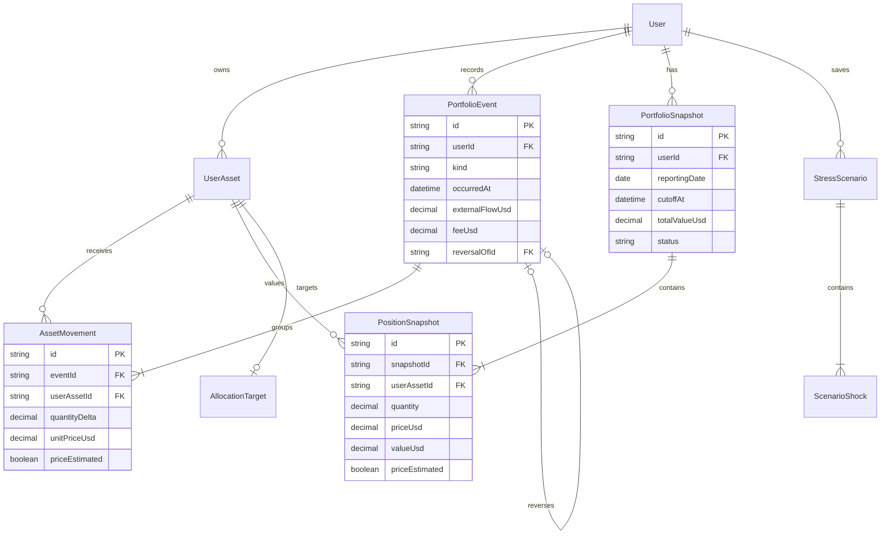
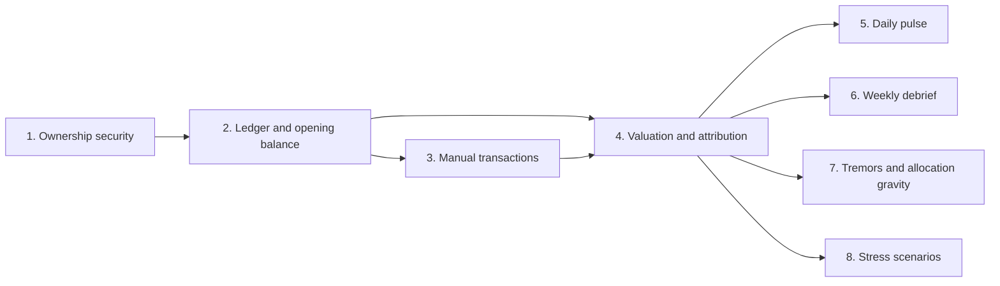

# feat: Add personal portfolio intelligence

## Overview

Turn Cryptfolio from a mutable balance tracker into a personal portfolio cockpit that operates at two speeds:

- **Daily pulse:** What changed, which coins caused it, and whether any allocation crossed its comfortable range.
- **Weekly debrief:** Why the week gained or lost value, how external flows differed from market performance, and how the current portfolio behaves under saved stress scenarios.

Existing holdings become the opening balance on adoption day. The user records future activity manually; no historical transaction backfill, exchange integration, social features, or automatic trading is included.

## Desired outcome

Cryptfolio can answer all of the following without treating a balance update as investment performance:

1. What is the portfolio worth now?
2. How much did it change today and this week?
3. How much came from external flows, fees, and coin-price movement?
4. Which coins contributed most to the change?
5. Which market movements materially affected this portfolio?
6. Which positions have drifted outside their target ranges?
7. What would selected price shocks do to the portfolio now?

## Current state

- `UserAsset.amount` is the mutable holding source and uses `Float`; old amounts are stored in `AssetArchive` (`prisma/schema.prisma:18`).
- Asset updates archive the old amount and overwrite the current amount (`src/app/actions/asset.ts:39`).
- The total-worth card multiplies current quantities by live CoinGecko prices but has no historical worth or attribution (`src/components/UserPortfolioValue/index.tsx:18`).
- The Trend page ranks generic market-cap movers rather than movements by personal portfolio impact (`src/app/trend/page.tsx:94`).
- CoinGecko historical market-chart data is already consumed for charts (`src/services/coin/marketChart.ts:4`).
- Position reads and final mutations are owner-scoped, with optimistic concurrency protecting archived history and automated cross-user query/mutation coverage (`src/services/asset/queries.ts`, `src/services/asset/mutations.ts`).
- The repository has no prior ADR, plan, issue-template, or documented-solutions convention.

## Product boundaries

### Included

- Opening-balance cutover with no backfill.
- Operator-created opening balances plus user-recorded buy, sell, transfer, swap, and fee events, with a correction operation that writes a reversal and replacement.
- Derived holdings and current worth.
- Stored daily snapshots plus live current valuation.
- Cash-flow-adjusted total and per-coin market movement.
- Daily pulse and weekly debrief.
- Personalized tremors, allocation ranges, and saved stress scenarios.

### Excluded

- Wallet and exchange synchronization.
- Trade execution or rebalance automation.
- Tax reporting or selectable tax-lot methods.
- Public profiles, social sharing, teams, or multiple portfolio owners.
- Historical performance before the adoption boundary.
- Additional fiat currencies in the first version.

## Architecture

The exact Prisma names may change during implementation, but the model boundaries should remain:



`PortfolioEvent` and `AssetMovement` form the immutable ledger. `UserAsset` remains the named position, while its quantity is derived from movement sums; a cached projection is permitted only if it is transactionally maintained and rebuildable.

## Calculation semantics

For a complete period:

```text
total change = ending worth - starting worth
market movement = total change - net external flow + fees
```

Equivalently:

```text
ending worth = starting worth + net external flow + market movement - fees
```

- Opening balances establish the starting worth and do not count as flow.
- Buys funded from outside and transfers into the tracked boundary are positive flow.
- Sells whose proceeds leave the tracked boundary and transfers out are negative flow.
- Swaps inside the tracked boundary have zero external flow.
- Fees are separate negative impact.
- Per-coin contribution uses the quantity held over each price interval and splits at event times.
- Reports with missing required prices display an incomplete state and never substitute zero.

## User flows

### Controlled adoption after ledger-aware writes

1. An operator freezes legacy balance writes or deploys the transaction-aware write path.
2. The system converts each positive existing balance into an opening event.
3. It persists the adoption boundary and verifies opening quantities exactly equal the pre-cutover amounts.
4. The daily-valuation slice creates the adoption-date valued baseline snapshot without inventing execution prices.
5. The user sees the same current holdings and no fabricated pre-adoption performance.

If conversion is retried, unique migration markers prevent duplicate opening events.

### Record a transaction

1. The user selects event type, position or coin, quantity, date/time, and optional actual USD total, fee, and note.
2. The server validates authentication, ownership, decimal values, timestamp, and resulting non-negative quantities.
3. The event and all movements are written atomically.
4. Holdings and current worth re-render from the ledger.
5. If the actual USD total is omitted, the event remains explicitly unvalued; this slice never invents an execution price from CoinGecko.

Swaps create both outgoing and incoming movements in one atomic event. Partial failure rolls back the whole swap.

### Correct a transaction

1. The user opens a ledger event and chooses correct or reverse.
2. Cryptfolio explains that the original remains immutable and that a reversal can be rejected when later activity relies on its balance.
3. The server creates a reversal and, when correcting, a replacement event.
4. Affected snapshots and reports are marked stale and recalculated.

### Daily snapshot

1. An authenticated production-only schedule runs after midnight in `America/Argentina/Salta`.
2. It selects a fixed cutoff and derives each position quantity at that cutoff.
3. It obtains prices, writes position lines, and upserts one snapshot per user/reporting date.
4. A retry returns the existing complete snapshot or safely replaces an incomplete snapshot.
5. A missed day can be repaired from historical prices and is marked estimated.

### Daily pulse

1. The latest completed daily snapshot is the starting point.
2. Live prices and current derived quantities produce the current point.
3. The view separates external flows, fees, and market movement.
4. It lists the highest absolute per-coin contributions and only shows allocation warnings outside configured ranges.

### Weekly debrief

1. The user selects the current or a prior complete week after adoption.
2. The view reconciles starting worth, net flow, fees, market movement, and ending worth.
3. It shows per-coin contribution and allocation changes.
4. Missing snapshots or prices produce a repair action or explicit incomplete state.

### Personalized tremors

Generic market movement is weighted by quantity held and estimated USD impact. Coins not held are absent by default. Thresholds are personal and quiet: percentage movement alone is insufficient if portfolio impact is immaterial.

### Allocation gravity

The user sets a minimum and maximum portfolio percentage per position. Cryptfolio reports positions outside their ranges and a hypothetical USD adjustment, but never places an order.

### Stress laboratory

The user saves named percentage shocks for one or more coins. Running a scenario applies shocks to current quantities and prices, then shows total and per-coin hypothetical impact without changing ledger or snapshot data.

## Flow and edge-case requirements

### Data integrity

- Use decimal database columns and explicit rounding rules for quantity and USD values.
- Reject zero-quantity events, invalid numeric input, future timestamps beyond a small clock-skew allowance, and transactions that produce negative holdings.
- Permit multiple named positions for the same CoinGecko coin.
- Archive zero-balance positions with history instead of deleting them.
- Ensure event creation, movement creation, and any maintained projection update share one database transaction.
- Make opening conversion, snapshot creation, and repair idempotent.

### Security

- Scope every read and write by authenticated `userId`, including nested movement and snapshot records.
- Protect the scheduled snapshot route with a dedicated secret and reject interactive session assumptions.
- Avoid exposing CoinGecko or scheduler secrets to client components or logs.

### External API failure

- Distinguish unavailable, rate-limited, and unknown-coin responses.
- Keep the last successful current price for a bounded fallback period, labeled stale.
- Never write a completed snapshot with a zero placeholder price.
- Support repair when CoinGecko returns historical data after a transient failure.
- Keep persisted historical snapshots stable after completion unless explicitly repaired.

### Time boundaries and concurrency

- Store timestamps in UTC and derive reporting dates with the IANA timezone.
- Use a fixed snapshot cutoff so events concurrent with snapshot creation land deterministically before or after it.
- Recalculate affected periods after a backdated event or correction.
- Treat same-day buy, sell, swap, and fee events in chronological order for contribution math.

### UX and accessibility

- Explain estimated, stale, incomplete, and repaired data in plain language.
- Use text and icons in addition to red/green color for gains, losses, and drift.
- Preserve keyboard access and mobile layouts for transaction and scenario forms.
- Confirm destructive reversals and show their effect before submission.

## Delivery slices

### 1. Secure portfolio ownership boundaries

Scope asset reads, updates, deletes, archive reads, and new financial records to the authenticated user before expanding the data surface.

**Acceptance criteria**

- [x] Another authenticated user cannot read or mutate a position by guessing its ID.
- [x] Server actions derive user identity from the session, not submitted form data.
- [x] Unauthorized and missing records have deliberate, tested responses.

### 2. Introduce opening balances and transaction ledger

Add decimal ledger models, an idempotent opening-balance cutover, and verification while retaining legacy data for rollback. This slice makes the schema and tooling deployable but does not run production conversion: apply waits for the ledger-aware write path in slice 3 or an explicit write freeze. The valued baseline snapshot belongs to slice 4.

**Acceptance criteria**

- [x] Each positive current holding produces exactly one opening event.
- [x] Derived post-cutover quantities exactly match the representable current amounts.
- [x] Retrying the conversion creates no duplicates.
- [x] No performance is shown before adoption.

### 3. Record manual transactions and derive holdings

Replace direct balance edits with end-to-end buy, sell, transfer, swap, fee, reversal, and correction flows.

**Acceptance criteria**

- [x] All event types update derived holdings atomically.
- [x] Negative resulting quantities are rejected.
- [x] Swaps roll back completely if either movement fails.
- [x] Positions with history are archived rather than deleted.

### 4. Track daily valuation and market movement

Add scheduled snapshots, missed-day repair, live current valuation, and reconciled attribution.

**Acceptance criteria**

- Worth changes when prices change without any transaction.
- Daily snapshots are idempotent and use the configured reporting boundary.
- Total change reconciles into external flow, fees, and market movement.
- Per-coin contributions sum to total market movement within tolerance.
- Missing prices yield an incomplete report, never a false zero.

### 5. Add daily portfolio pulse

Turn the home summary into a concise daily explanation with current worth, market movement, flows, fees, and leading coin contributions.

**Acceptance criteria**

- Daily totals distinguish transactions from market movement.
- The most materially positive and negative coin contributions are visible.
- Estimated, stale, and incomplete states are understandable and accessible.

### 6. Add weekly portfolio debrief

Add a weekly report using the same reconciliation engine, with allocation changes and repair paths.

**Acceptance criteria**

- Current and prior post-adoption weeks can be viewed.
- Starting worth, flows, fees, market movement, and ending worth reconcile.
- Per-coin contribution and allocation change are shown.
- Weeks crossing the adoption boundary are clearly limited or unavailable.

### 7. Add personalized tremors and allocation gravity

Weight market moves by personal USD impact and add quiet target allocation ranges.

**Acceptance criteria**

- Tremors are ordered by personal impact, not generic percentage movement.
- Thresholds suppress immaterial noise.
- Each target accepts valid minimum and maximum percentages.
- Drift shows hypothetical adjustment only and never executes a trade.

### 8. Add saved stress scenarios

Allow named multi-coin shocks to run against the current derived portfolio.

**Acceptance criteria**

- Scenarios can be created, edited, run, and archived.
- Results show total and per-coin hypothetical impact.
- Running a scenario never changes ledger, holdings, or snapshots.
- Missing live prices produce a partial/incomplete result rather than zero impact.

## Delivery order



After valuation is stable, the four experience slices can be developed independently.

## GitHub tracking

- [Milestone: Personal Portfolio Intelligence](https://github.com/mrcportillo/cryptfolio/milestone/1)
- [#6: Build personal portfolio intelligence](https://github.com/mrcportillo/cryptfolio/issues/6)
- [#7: Scope portfolio records to the authenticated owner](https://github.com/mrcportillo/cryptfolio/issues/7)
- [#8: Introduce opening balances and transaction ledger](https://github.com/mrcportillo/cryptfolio/issues/8)
- [#9: Record manual transactions and derive holdings](https://github.com/mrcportillo/cryptfolio/issues/9)
- [#10: Track daily valuation and price-driven movement](https://github.com/mrcportillo/cryptfolio/issues/10)
- [#11: Add daily portfolio pulse](https://github.com/mrcportillo/cryptfolio/issues/11)
- [#12: Add weekly portfolio debrief](https://github.com/mrcportillo/cryptfolio/issues/12)
- [#13: Add personalized tremors and allocation ranges](https://github.com/mrcportillo/cryptfolio/issues/13)
- [#14: Add saved portfolio stress scenarios](https://github.com/mrcportillo/cryptfolio/issues/14)

## Testing and verification

### Unit tests

- Signed movement aggregation and decimal rounding.
- External-flow and fee classification.
- Period reconciliation and per-coin contribution.
- Allocation drift and stress-scenario calculations.
- Local reporting-date conversion around UTC boundaries.

### Integration tests

- Ownership enforcement for every record type.
- Atomic swap and reversal/correction behavior.
- Opening conversion and snapshot retry idempotency.
- Concurrent event versus snapshot cutoff behavior.
- Backdated event invalidation and report recalculation.
- CoinGecko success, stale cache, rate limit, unknown coin, and missing historical price cases.

### Browser tests

- First post-cutover visit preserves visible balances.
- Manual transaction happy paths and validation recovery.
- Daily and weekly report states on desktop and mobile.
- Keyboard operation and non-color status communication.
- Scenario creation and target-range editing do not mutate holdings.

### Migration verification

- Count positive legacy positions and opening events per user.
- Compare every legacy amount with the derived ledger quantity.
- Compare pre-cutover current worth with post-cutover current worth using the same price set.
- Retain legacy columns and archives until these checks pass in production.

## Operational considerations

- Vercel cron schedules are UTC and production-only; configure the route after local midnight and calculate the reporting date explicitly.
- Keep the cron route idempotent because delivery may be retried or delayed.
- Batch CoinGecko requests by unique coin where supported, cache successful current prices briefly, and expose repair status.
- Log snapshot date, cutoff, counts, duration, source status, and reconciliation result without logging secrets or sensitive session data.
- Provide a manual snapshot/repair command so the personal tool is not hostage to the scheduler.

## Risks and mitigations

| Risk                                                     | Mitigation                                                                                    |
| -------------------------------------------------------- | --------------------------------------------------------------------------------------------- |
| Float-to-decimal conversion changes displayed quantities | Verify each derived quantity before switching reads; retain legacy data during rollout.       |
| CoinGecko limits or outage create gaps                   | Store completed snapshots, cache bounded fallbacks, and provide idempotent historical repair. |
| A backdated event changes a completed report             | Mark affected snapshots stale and recalculate with an audit trail.                            |
| Incorrect flow classification distorts performance       | Make external-flow semantics explicit in forms and test the reconciliation equation.          |
| Snapshot races with transaction entry                    | Use a fixed cutoff and deterministic occurred-at comparison.                                  |
| Position IDs leak data across authenticated users        | Complete and test ownership hardening before adding the ledger surface.                       |

## Success criteria

- A day with no transactions still shows worth change caused by live coin prices.
- Adding value to the portfolio changes external flow but does not inflate market performance.
- A weekly report reconciles to the cent or configured decimal tolerance.
- Every material market movement can be attributed to one or more held coins.
- Existing balances survive the cutover exactly and begin history at the adoption boundary.
- All financial records remain private to the authenticated user.

## Documentation

- Link ADR 0001 from the README architecture section.
- Document transaction semantics and examples for personal use.
- Document snapshot scheduling, secret configuration, manual repair, and operational checks.
- Record the eventual legacy-field removal as a separate follow-up after production verification.

## References

### Internal

- `docs/adr/0001-transaction-ledger-and-portfolio-valuation.md`
- `prisma/schema.prisma:18`
- `src/app/actions/asset.ts:39`
- `src/components/UserPortfolioValue/index.tsx:18`
- `src/app/trend/page.tsx:94`
- `src/services/coin/marketChart.ts:4`
- `src/utils/db-api.ts:4`

### External

- [CoinGecko historical market chart range](https://docs.coingecko.com/reference/coins-id-market-chart-range)
- [CoinGecko historical data by date](https://docs.coingecko.com/reference/coins-id-history)
- [Vercel Cron Jobs quickstart](https://examples.vercel.com/docs/cron-jobs/quickstart)
