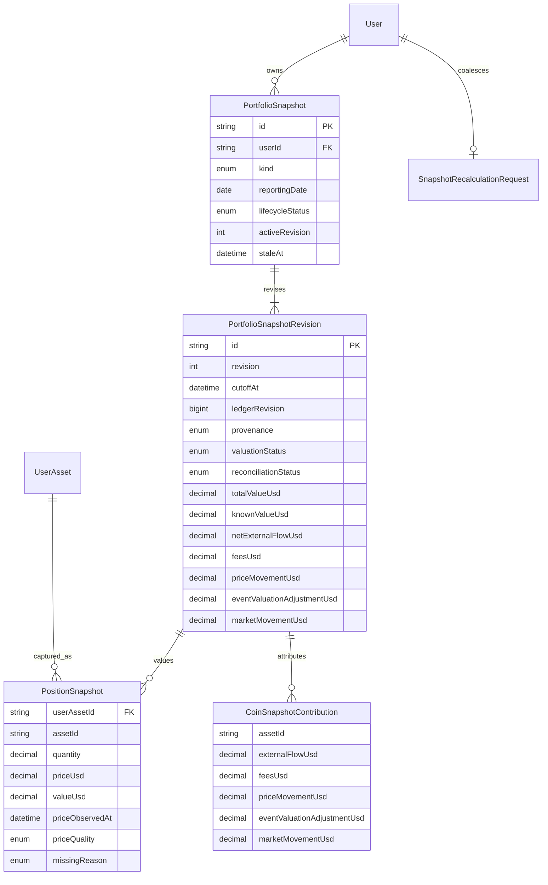

# feat: Track daily valuation and price-driven movement

## Overview

Add an auditable valuation layer above the immutable transaction ledger. The home page keeps using live CoinGecko prices, but incomplete current pricing becomes explicit instead of silently understating worth. Historical valuation uses one logical daily snapshot per closed Salta calendar day plus a distinct adoption baseline, immutable calculation revisions, deterministic price selection, and exact reconciliation into external flow, fees, pure price movement, and the event-valuation adjustment required to make per-coin contributions reconcile.

This plan implements GitHub issue #10 only. It deliberately stops before the daily pulse, weekly debrief, personalized tremors/allocation ranges, and stress scenarios in issues #11-#14.

## Research summary

### Internal evidence

- ADR 0001 requires hybrid live/stored valuation, one fixed-cutoff daily snapshot, independently authenticated scheduling, repaired historical prices marked estimated, exact decimals, and incomplete rather than zero values.
- The implementation plan defines `ending worth = starting worth + external flow + market movement - fees` and requires per-coin contribution over price intervals split at ledger-event timestamps.
- Opening conversion preserves exact quantities and intentionally leaves `AssetMovement.unitPriceUsd` NULL. This slice must value the adoption baseline without inventing execution prices or pre-adoption history.
- Post-adoption holdings are exact `Decimal(65,30)` movement sums read in `REPEATABLE READ`. Manual writes use serializable transactions, a shared per-owner advisory lock, an owner tuple-version lock, bounded retry, and deferred database constraints.
- `calculatePortfolioValue` currently skips missing prices and can return zero for an entirely unpriced positive portfolio. That violates issue #10.
- Middleware currently requires an Auth0 browser session for all non-auth API routes, so a cron route needs a narrow middleware exemption and its own fail-closed bearer authentication.
- The repository has no `docs/solutions` or critical-pattern corpus; the ADR, plan, runbooks, schema, and code are the authoritative local record.

### Current official constraints

- Vercel cron invokes a production GET route, schedules in UTC, may deliver duplicates/overlaps, does not retry failed jobs, and sends `Authorization: Bearer <CRON_SECRET>` when configured.
- `America/Argentina/Salta` is UTC-03:00 for this product contract. A job shortly after local midnight is configured in UTC, while the logical cutoff is calculated independently from delivery time.
- CoinGecko range data does not guarantee a sample exactly at the requested boundary. The implementation must select the latest observation at or before the cutoff within a fixed maximum age and persist the provider timestamp.
- CoinGecko historical daily `/history` is fixed at 00:00 UTC and therefore cannot stand in for Salta midnight. `/coins/{id}/market_chart/range` is the appropriate repair source.
- Historical access and granularity depend on plan/age. Unavailable data remains explicitly missing/incomplete. No deprecation was found for the price endpoints used by this plan.

## Decisions

### Reporting boundary

- A daily snapshot with `reportingDate = D` represents the closed local day `[D 00:00, D+1 00:00)` in `America/Argentina/Salta`.
- Its immutable `cutoffAt` is exactly local midnight at the start of `D+1`, stored as UTC. The scheduled GET runs after that boundary (initial production schedule: 03:10 UTC).
- Daily holdings include events with `occurredAt < cutoffAt`; period events are selected with the same half-open convention.
- The adoption baseline is a separate `ADOPTION_BASELINE` logical snapshot at exactly `ledgerAdoptedAt` and includes opening movements at that instant. It can coexist with the adoption day's daily closing snapshot.
- No logical snapshot or report starts before adoption. Manual daily creation rejects an open/future local day.

### Logical snapshots and immutable revisions

Use one owner-scoped logical header per `(userId, kind, reportingDate)` and append immutable calculation revisions:



- Lifecycle (`COMPLETE`, `INCOMPLETE`, `STALE`), revision provenance (`SCHEDULED`, `MANUAL`, `REPAIR`, `ADOPTION_BASELINE`), and price quality (`OBSERVED`, `STALE_FALLBACK`, `HISTORICAL_ESTIMATE`, `MISSING`) are independent.
- A missing required line keeps `priceUsd`, `valueUsd`, and `totalValueUsd` NULL. `knownValueUsd` is stored only as a clearly named subtotal; it must never be presented as total worth.
- Repair never overwrites calculation evidence. It appends a revision with actor/source, bounded reason, retrieval time, provider observations, and the captured ledger revision, then atomically changes the active pointer.
- Revision and line records are database-immutable. Header lifecycle metadata and the active pointer are the only mutable snapshot fields.

### Ledger coordination and invalidation

- Add a monotonic `User.ledgerRevision`, incremented by database trigger for every inserted movement.
- Snapshot input capture records the revision, fetches prices outside a database transaction, then enters a serializable transaction using the same per-owner advisory/tuple lock as ledger writers. Activation rechecks the revision; a mismatch retries from fresh inputs.
- A movement insert atomically marks every affected active logical snapshot stale and upserts one owner-scoped recalculation request at the earliest affected instant. A daily cutoff is affected when `occurredAt < cutoffAt`; an adoption baseline is affected when `occurredAt <= cutoffAt`.
- Correction naturally invalidates from the earliest original/reversal/replacement timestamp because the inserted movements drive the trigger.
- Scheduled execution first repairs queued/stale/incomplete work in bounded chronological order, then fills missing closed days. Failed price retrieval leaves durable incomplete work for the next schedule/manual repair.

### Price selection and quality

- Snapshot/adoption/event-boundary prices come from CoinGecko `market_chart/range`, never from an invented execution price and never from `/history`'s UTC-midnight point.
- The selector is deterministic: choose the latest observation whose timestamp is at or before the requested instant; break ties by input order; reject observations older than two hours.
- A scheduled calculation retrieved shortly after cutoff is `OBSERVED` when the selected point is no more than 15 minutes old. An older accepted scheduled point is `STALE_FALLBACK`.
- Adoption/manual/repair reconstruction uses `HISTORICAL_ESTIMATE`. A repair revision remains visibly repaired through its provenance even when complete.
- Rate limit, provider unavailable, unknown coin, invalid response, and no acceptable observation are distinct missing reasons. Missing values stay NULL.
- Live home valuation continues to use batched current markets, but now returns exact total/known-subtotal strings and `COMPLETE`, `STALE`, or `INCOMPLETE` quality based on coverage and provider timestamps.

### Exact decimal and reconciliation rules

- Quantities, prices, values, flows, fees, and contributions use canonical plain decimals at database scale 30. JavaScript `number` is confined to parsing CoinGecko's JSON response and display/chart approximation.
- Convert finite provider numbers to canonical plain decimal text, multiply in BigInt scale-30 units, and round half away from zero once per persisted multiplication. Aggregate already-quantized line values in stable `(assetId, positionId)` order.
- Central reconciliation tolerance: `0.00000001` USD. Complete persisted results are expected to reconcile exactly; the tolerance protects provider/serialization edge boundaries and is tested in scale units rather than display cents.
- Unknown boundary-crossing flow or tracked-coin fee USD makes reconciliation incomplete. Semantic zeros remain exact: opening, swap external flow, and an event with no fee movement.
- For each coin and price interval split at event timestamps:

```text
price movement = sum(quantity before interval × (ending price - starting price))
coin market movement = ending value - starting value - coin external flow + coin fees
event valuation adjustment = coin market movement - price movement
```

- The adjustment is required when actual transaction value differs from CoinGecko's reference price, for swaps whose legs are not equal at the reference point, and for fee/reference-value differences. Persisting it keeps the pure price component honest while satisfying the ADR's three-bucket total equation.
- Header market movement is the residual `ending - starting - net external flow + fees`. Per-coin `marketMovementUsd` values must sum to it within tolerance; otherwise the revision is incomplete and cannot be activated as complete.

## Implementation phases

### 1. Exact domain and provider boundary

- Extend `src/services/portfolio-transactions/decimal.ts` with finite-number normalization, subtraction, comparison, multiplication/rounding, absolute difference, and summation helpers while preserving existing behavior.
- Add `src/services/portfolio-valuation/domain.ts` for Salta reporting dates/cutoffs, provider observation selection, live valuation completeness, snapshot valuation, period event allocation, price-interval movement, and reconciliation.
- Add an injectable CoinGecko range provider with typed failure reasons, bounded retries, encoded coin IDs, server-only key handling, and no secret logging.

### 2. Additive schema and PostgreSQL invariants

- Add the snapshot/revision/position/contribution/recalculation models and orthogonal enums to Prisma.
- Add owner-safe composite foreign keys, unique logical/revision keys, finite numeric/timestamp checks, nonnegative price/value/quantity checks, active-revision integrity, and targeted indexes.
- Add revision/line immutability triggers, header-mutation guard, ledger-revision bump, affected-snapshot staleness, and coalesced recalculation trigger.
- Extend deferred-constraint flushing/catalog verification where the new invariants require it.

### 3. Service, scheduler, and manual repair

- Add dependency-injected valuation orchestration plus a PostgreSQL store using bounded serializable retry and the existing owner lock namespace.
- Create/fill the adoption baseline idempotently without changing opening movements or writing execution prices.
- Create logical daily rows/revisions idempotently; retry incomplete work; append repair revisions; process invalidation requests chronologically.
- Add a production-only Vercel cron GET route with constant-time bearer validation and no Auth0/session dependency. Narrowly exempt only that path from session middleware.
- Add a dry-run-first manual CLI requiring explicit user/date or adoption-baseline target; repair requires a bounded reason and explicit apply flag.

### 4. Live valuation UI boundary

- Replace the home total's number-only contract with an exact live valuation result.
- Show total only when complete/stale-valued; show a clear incomplete state and known subtotal separately when any positive holding lacks a price.
- Use text/icon status in addition to color and preserve the current responsive visual language. Do not add daily pulse, historical contribution ranking, or weekly-report UI.

### 5. Verification and operations

- Add exact offline domain/service/provider/auth tests with no network or database.
- Add a separate disposable loopback PostgreSQL suite using an explicit database name containing `cryptfolio` and `test`; deploy all migrations and verify Prisma diff, constraints, idempotency, rollback, concurrent capture, and correction invalidation.
- Add safe scheduler/repair/adoption runbook instructions, verification SQL, rollback limits, and 24-hour monitoring.
- Run lint, typecheck, full offline tests, disposable PostgreSQL tests, Prisma validation/diff, dependency audit, and an env-free production build.

## Acceptance matrix

| Requirement                                          | Evidence target                                                                      |
| ---------------------------------------------------- | ------------------------------------------------------------------------------------ |
| Price-only worth changes                             | Live valuation unit/component test with unchanged holdings and two price sets        |
| One fixed-cutoff daily snapshot                      | Timezone tests plus logical unique key and concurrent PostgreSQL idempotency test    |
| Dedicated scheduled auth                             | Route/middleware tests for missing, invalid, valid secret and absent browser session |
| Exact total reconciliation                           | Adversarial buy/sell/transfer/swap/fee/reversal tests at scale 30                    |
| Per-coin reconciliation                              | Contribution sum/tolerance tests with multiple positions per coin                    |
| Explicit missing/stale/estimated/repaired/incomplete | Provider/domain/UI state tests and nullable database constraints                     |
| Backdated correction repair                          | Real PostgreSQL correction/invalidation/queue/revision test                          |
| Manual snapshot/repair                               | CLI parser/dry-run/idempotent apply/failure-retry tests and runbook                  |
| No-backfill adoption baseline                        | Baseline kind/cutoff/quantity/NULL execution-price and no-pre-adoption tests         |

## Security and data-integrity gates

- Cron secret and CoinGecko keys are server-only, fail closed, compared safely, and never logged.
- Every snapshot, revision, line, contribution, queue, event, and position lookup is owner-scoped; composite foreign keys reject cross-owner links.
- No production job or real database is accessed during implementation or verification.
- All external input (route headers, CLI dates/reasons/user IDs, provider JSON) is validated and bounded.
- Interrupted, duplicated, overlapping, and retried jobs cannot activate partial or competing revisions.
- Rollback after revision creation disables writers/cron and repairs forward; immutable evidence is not deleted.

## Deployment outline

1. Record pre-deploy ledger/snapshot counts and verify no pre-existing valuation objects.
2. Deploy the additive migration and generated Prisma client; verify triggers, indexes, owner-safe FKs, and empty schema diff.
3. Deploy application code with `CRON_SECRET` and the server-only CoinGecko credential configured, but validate the cron path manually before enabling schedule registration.
4. Run dry-run adoption baseline and latest closed-day commands for the personal owner; do not apply until fingerprints/counts and provider coverage are reviewed.
5. Enable the production cron, then verify one logical row, one active revision, line totals, NULL propagation, and reconciliation SQL within five minutes.
6. Monitor route failures, provider missing reasons, stale/incomplete counts, recalculation queue age, duration, and duplicate delivery for 24 hours.

## Risks and mitigations

| Risk                                                   | Mitigation                                                                               |
| ------------------------------------------------------ | ---------------------------------------------------------------------------------------- |
| Delivery time drifts from logical cutoff               | Persist cutoff separately and reject/label observations outside fixed age windows        |
| Provider changes or gaps alter repair results          | Store immutable revisions, observation timestamps, quality, and repair provenance        |
| Ledger write races snapshot activation                 | Monotonic ledger revision plus shared owner lock and database invalidation trigger       |
| Actual transaction value differs from market reference | Persist pure price movement and explicit event-valuation adjustment                      |
| Unknown flow/fee is treated as zero                    | Only semantic zeros are materialized; unknown remains NULL and reconciliation incomplete |
| Mid-day adoption collides with daily row               | Separate `ADOPTION_BASELINE` and `DAILY` logical kinds                                   |
| Issue #10 expands into reports                         | Limit UI work to the live worth completeness boundary and operational state only         |

## References

- GitHub issue #10
- `docs/adr/0001-transaction-ledger-and-portfolio-valuation.md`
- `docs/plans/2026-08-20-feat-personal-portfolio-intelligence-plan.md`
- `docs/operations/opening-balance-cutover.md`
- `docs/operations/manual-transactions-cutover.md`
- CoinGecko simple price and market-chart-range official references
- Vercel Cron Jobs and cron management official references
- Next.js 15 Route Handler documentation
