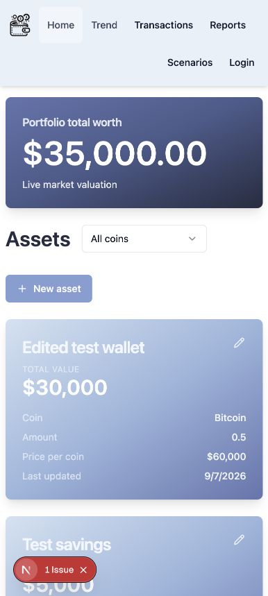
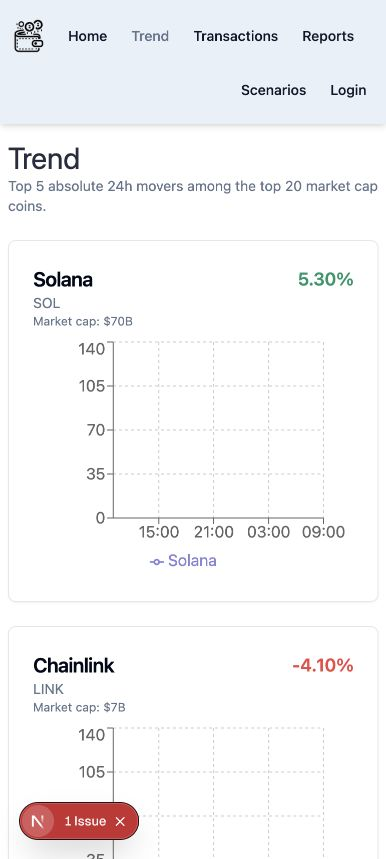

# Legacy page recovery verification

Verified 2026-09-07 with the repaired source in an environment-free temporary Next.js
mirror. Authentication and public market prices were synthetic fixtures. All
portfolio reads and writes used the actual application services against a local
PostgreSQL schema containing only the original baseline migration. No production
holdings, credentials, or screenshots are included.

- Home rendered both synthetic holdings and their combined live value.
- The asset editor saved a new alias and amount; Home recomputed the total.
- Asset detail showed the updated holding and its archived quantity history.
- Trend displayed five market movers and five rendered price charts.
- Transactions and transaction creation showed the ledger setup state.
- Weekly reports and Scenarios showed their pre-adoption setup messages.
- An unavailable transaction detail showed its scoped not-found page.
- After adding only an adoption marker in the disposable fixture, the missing
  ledger tables caused personal insights to fail. All five Trend charts remained
  rendered and only the personal section displayed a temporary-unavailable message.
  The intentional error also appears in Next.js development diagnostics.

These checks verify application behavior with controlled auth/provider fixtures.
They do not substitute for the hosted Auth0 callback and production domain checks.
Development also reported existing useFormState deprecation and missing dialog
accessibility-description warnings during editing; the save completed correctly.
